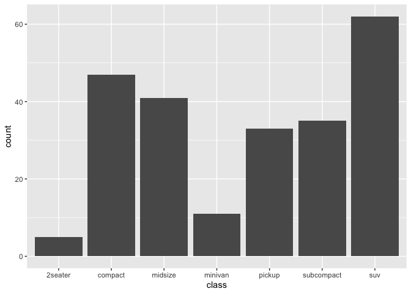
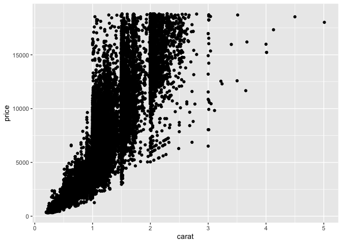

# Vis: Data Visualization Basics

*Purpose*: The most powerful way for us to learn about a dataset is to
*visualize the data*. Throughout this class we will make extensive use
of the *grammar of graphics*, a powerful graphical programming *grammar*
that will allow us to create just about any graph you can imagine\!

## Optional (But Recommended\!) Reading

If you have time before DataFest, I highly recommend working through the
following reading:

*Optional Reading*: [Data Visualization
Basics](https://rstudio.cloud/learn/primers/1.1). **Note**: In RStudio
use `Ctrl + Click` (Mac `Command + Click`) to follow the link. *Topics*:
`Welcome`, `A code template`, `Aesthetic mappings`. *Reading Time*: \~
30 minutes

# (LIVE DEMO): Overview of `ggplot`

We will walk through the following code together in the tutorial.

## Getting set up

The following code chunk will set up our coding environment. You must
*execute* the code chunk, to do so, either:

  - Click the **green arrow** at the right end of the code chunk, *OR*
  - Click inside the code chunk, then press the key combination *Control
    + Enter*

If you do this correctly, you should see about a dozen lines of text
appear below the chunk. These should say *Attaching packages*, along
with a list of packages and version numbers. If you don’t see this, make
sure to ask for help\!

``` r
library(tidyverse)
```

    ## ── Attaching core tidyverse packages ────────────────────────────────────── tidyverse 2.0.0 ──
    ## ✔ dplyr     1.1.1     ✔ readr     2.1.4
    ## ✔ forcats   1.0.0     ✔ stringr   1.5.0
    ## ✔ ggplot2   3.4.1     ✔ tibble    3.2.1
    ## ✔ lubridate 1.9.2     ✔ tidyr     1.3.0
    ## ✔ purrr     1.0.1     
    ## ── Conflicts ──────────────────────────────────────────────────────── tidyverse_conflicts() ──
    ## ✖ dplyr::filter() masks stats::filter()
    ## ✖ dplyr::lag()    masks stats::lag()
    ## ℹ Use the conflicted package (<http://conflicted.r-lib.org/>) to force all conflicts to become errors

## Anatomy of a `ggplot`

We use `ggplot` to visualize data, but first we need some data to
visualize\! The following code will display the `mpg` dataset. This is a
dataset of performance characteristics for a couple hundred models of
imported cars.

(Execute the following code chunk to show & inspect the dataset.)

``` r
mpg
```

    ## # A tibble: 234 × 11
    ##    manufacturer model      displ  year   cyl trans drv     cty   hwy fl    class
    ##    <chr>        <chr>      <dbl> <int> <int> <chr> <chr> <int> <int> <chr> <chr>
    ##  1 audi         a4           1.8  1999     4 auto… f        18    29 p     comp…
    ##  2 audi         a4           1.8  1999     4 manu… f        21    29 p     comp…
    ##  3 audi         a4           2    2008     4 manu… f        20    31 p     comp…
    ##  4 audi         a4           2    2008     4 auto… f        21    30 p     comp…
    ##  5 audi         a4           2.8  1999     6 auto… f        16    26 p     comp…
    ##  6 audi         a4           2.8  1999     6 manu… f        18    26 p     comp…
    ##  7 audi         a4           3.1  2008     6 auto… f        18    27 p     comp…
    ##  8 audi         a4 quattro   1.8  1999     4 manu… 4        18    26 p     comp…
    ##  9 audi         a4 quattro   1.8  1999     4 auto… 4        16    25 p     comp…
    ## 10 audi         a4 quattro   2    2008     4 manu… 4        20    28 p     comp…
    ## # ℹ 224 more rows

To construct a plot using ggplot, we can use code like the following:

``` r
ggplot(mpg, aes(x = displ, y = cty)) +
  geom_point()
```

<!-- -->

This is a scatterplot of the city fuel economy (`cty`) against the
engine displacement volume (`displ`). As we can see, larger engines tend
to have lower fuel economy, but this trend “bottoms out” for the largest
engines.

Let’s take apart the ggplot syntax:

    # Start a plot with `ggplot()`
    ggplot(
        data = mpg,                       # Which dataset to use
        mapping = aes(x = displ, y = cty) # The aesthetic mapping; x = horizontal axis, y = vertical axis
      ) +
      geom_point()                        # Show each row using a point

To plot different variables, we can chanve the *aes*thetic mapping; this
is done through the `aes()` function. For instance, the following code
shows highway fuel economy (`hwy`) instead.

``` r
ggplot(
    data = mpg, 
    # aes(x = displ, y = cty) # Old code
    aes(x = displ, y = hwy) # New code, note change in y
  ) +
  geom_point()
```

<!-- -->

## Helpful list of geometries

Here is a helpful list of `geom_*()` functions we can use in ggplot.

### Histogram

Histograms are useful for exploring one variable at a time. A histogram
gives us a sense for how a numeric quantity is distributed.

For instance, the following shows a histogram of `hwy`.

``` r
mpg %>% 
  ggplot(aes(x = hwy)) +
  geom_histogram()
```

    ## `stat_bin()` using `bins = 30`. Pick better value with `binwidth`.

<!-- -->

A histogram takes a continuous variable, splits its range of values into
`bins`, and counts the number of observations that land in each bin. The
counts are shown as bars, with the bar widths representing the bin
widths, and the bar heights representing the number of observations in
each bin.

The histogram above shows us that `hwy` values around \~16 are common,
as are values around \~26. Highway fuel economy can go as low as about
12 and over 40.

One of the most important things we should do with histograms is **play
with the number of bins**. This graphical parameter can drastically
change what we see:

``` r
mpg %>% 
  ggplot(aes(x = hwy)) +
  geom_histogram(bins = 20)
```

<!-- -->

Here we still see the two peaks around \~16 and \~26, which lends some
confidence to our prior observations.

``` r
mpg %>% 
  ggplot(aes(x = hwy)) +
  geom_histogram(bins = 60)
```

<!-- -->

The “fingers” we see above suggest that we have too many bins. We should
reduce the `bins` argument.

### Frequency Polygons

A frequency polygon is very similar to a histogram, except the number of
observations is shown using a line rather than a bar. This is helpful
when we want to show counts for multiple different groups. For instance,
the following shows the distribution of highway fuel economy (`hwy`)
values, but as separate curves for each `class` of vehicle.

``` r
ggplot(
    data = mpg,
    mapping = aes(x = hwy, color = class) # Note the additional `color` argument
  ) +
  geom_freqpoly(bins = 10)
```

<!-- -->

From this display, we can see that `suv` and `pickup` class vehicles
tend to have much lower fuel economy than other types. Additionally, we
can now see that that “bulge” of `hwy` values around \~16 was `suv` and
`pickup` vehicles\!

### Bars

Histograms (and frequency polygons) are used to show *continuous*
variables. When we have discrete variables, we should use a `geom_bar()`
to show the counts. For instance, we can show the number of vehicles in
each `class` with a bar chart.

``` r
ggplot(
  data = mpg,
  mapping = aes(x = class)
) +
  geom_bar()
```

<!-- -->

For discrete variables, we don’t need to split the data into bars. Hence
the need to use `geom_bar()` vs `geom_histogram()`.

### Scatterplots (With layers and color)

Above, we saw how to make a scatterplot using `geom_point()`. However,
there are some more advanced ggplot features we can use to make more
informative scatterplots. For instance, we can add *multiple* sets of
points to visualize different variables. For instance, the following
plot shows both `hwy` and `cty` on the same plot, and distinguishes the
points using the `color` aesthetic.

``` r
ggplot(
  data = mpg,
  mapping = aes(x = displ)
) +
  geom_point(mapping = aes(y = hwy, color = "hwy")) +
  geom_point(mapping = aes(y = cty, color = "cty"))
```

<!-- -->

Note that I didn’t specify `x` in the `aes()` call for either point.
This is because the geometries *inherit* the `x` mapping set in the
`ggplot()` call. In this sense, ggplot is a *layered* grammar of
graphics.

### Guidelines

There are a variety of “guideline” geometries we can use to annotate a
plot. For instance, `geom_abline()` just draws a straight line, which is
useful as a reference.

``` r
ggplot(
  data = mpg,
  mapping = aes(x = hwy, y = cty)
) +
  geom_abline(intercept = 0, slope = 1) +
  geom_point()
```

<!-- -->

This shows us very cleanly that the `cty` of a car is always lower than
its `hwy` fuel economy.

We can also draw guidelines that are based on the data. The following
code is a bit more sophisticated than what we’ve seen so far. However,
it illustrates that we can draw a horizontal guidelines for each class
of car based on its mean fuel economy.

``` r
ggplot(
  data = mpg,
  mapping = aes(x = displ, y = hwy, color = class)
) +
  geom_hline(
    data = mpg %>% 
      group_by(class) %>% 
      summarize(hwy = mean(hwy)),
    mapping = aes(yintercept = hwy, color = class),
    size = 1,
    alpha = 1 / 3
  ) +
  geom_point()
```

    ## Warning: Using `size` aesthetic for lines was deprecated in ggplot2 3.4.0.
    ## ℹ Please use `linewidth` instead.
    ## This warning is displayed once every 8 hours.
    ## Call `lifecycle::last_lifecycle_warnings()` to see where this warning was generated.

<!-- -->

# (EXERCISES)

Try each of these on your own\!

### **q1** Inspect the data

Inspect the `diamonds` dataset. What do the `cut`, `color`, and
`clarity` variables mean?

*Hint* We learned how to inspect a dataset above.

``` r
## TODO: Inspect the `diamonds` dataset here
diamonds
```

    ## # A tibble: 53,940 × 10
    ##    carat cut       color clarity depth table price     x     y     z
    ##    <dbl> <ord>     <ord> <ord>   <dbl> <dbl> <int> <dbl> <dbl> <dbl>
    ##  1  0.23 Ideal     E     SI2      61.5    55   326  3.95  3.98  2.43
    ##  2  0.21 Premium   E     SI1      59.8    61   326  3.89  3.84  2.31
    ##  3  0.23 Good      E     VS1      56.9    65   327  4.05  4.07  2.31
    ##  4  0.29 Premium   I     VS2      62.4    58   334  4.2   4.23  2.63
    ##  5  0.31 Good      J     SI2      63.3    58   335  4.34  4.35  2.75
    ##  6  0.24 Very Good J     VVS2     62.8    57   336  3.94  3.96  2.48
    ##  7  0.24 Very Good I     VVS1     62.3    57   336  3.95  3.98  2.47
    ##  8  0.26 Very Good H     SI1      61.9    55   337  4.07  4.11  2.53
    ##  9  0.22 Fair      E     VS2      65.1    61   337  3.87  3.78  2.49
    ## 10  0.23 Very Good H     VS1      59.4    61   338  4     4.05  2.39
    ## # ℹ 53,930 more rows

Now that we have the list of variables in the dataset, we know what we
can visualize\!

### **q2** Make a bar chart

Complete the code below to make a bar chart of the `cut` of each
diamond. Answer the questions below.

``` r
## TODO: Complete this code
ggplot(
  data = diamonds,
  mapping = aes(x = cut)
) +
  geom_bar()
```

<!-- -->

*Observations* - Which `cut` is most common? - `Ideal` - Which `cut` is
least common? - `Fair` - `Ideal` cuts will tend to be more desirable,
while `Fair` cuts will tend to be less desirable. Does their relative
abundance in the dataset match your expectations? - Initially, I would
expect the more desirable cuts to be rarer. However, cut is something a
jeweler can finely control; it’s a way to add value. Since this is a
dataset of diamonds that are for-sale, this relative abundance makes
sense.

### **q3** Make a histogram

Complete the following code to make a histogram of the `carat` variable.

``` r
## TODO: Complete this code
ggplot(
  data = diamonds,
  mapping = aes(x = carat)
) +
  geom_histogram(bins = 120)
```

<!-- -->

*Hint*: You should see `carat` on the horizontal axis, and the range
should go from about `0` to `5`.

### **q4** Make a targeted histogram

The following code *filters* the dataset to only those rows where `carat
<= 1.1`. Complete the code to make a histogram of the `carat` values.
Answer the questions below.

``` r
## TODO: Complete the following code
ggplot(
  data = diamonds %>% 
    filter(carat <= 1.1),
  mapping = aes(x = carat)
) +
  geom_histogram(bins = 100) +
  scale_x_continuous(
    breaks = c(0, 0.3, 0.4, 0.5, 0.7, 0.9, 1)
  )
```

<!-- -->

*Observations* - Compare the range of `carat` values shown in your plot
for q4 to your plot for q3. What is different? - The range is now much
smaller, from 0 to 1.2 - How many “spikes” (especially high-count
regions of `carat`) can you find in the histogram? Where are they
located? *Hint* You will **need** to increase the number of `bins` to
see all the spikes\! - I see about 6 “spikes,” located at: 0.3, 0.4,
0.5, 0.7, 0.9, and 1.0 - Do the spikes tend to be symmetric around their
highest value? Or do they “taper” to one side? - The spikes are
consistently asymmetric; they tend to drop off rapidly towards lower
values, but slope gently towards larger values. - What might be the
reason for the shape of the spikes? - It seems there’s a preference for
the “special” values noted above (spike locations), with some desire to
land just above these values, and a strong aversion to landing just
below these values.

### **q5** Make a scatterplot

Using `ggplot`, make a scatterplot with `price` on the vertical axis and
`carat` on the horizontal axis. Answer the questions below.

``` r
## TODO: Complete this code
ggplot(diamonds) +
  geom_point(aes(x = carat, y = price))
```

<!-- -->

**Observations**:

  - `price` generally increases with `carat`
  - The trend is not ‘clean’; there is no single curve in the
    relationship

## A note on *aesthetics*

The function `aes()` is short for *aesthetics*. Aesthetics in ggplot are
the mapping of variables in a dataframe to visual elements in the graph.
For instance, in the plot above you assigned `carat` to the `x`
aesthetic, and `price` to the `y` aesthetic. But there are *many more*
aesthetics you can set, some of which vary based on the `geom_` you are
using to visualize. The next question will explore this idea more.

### **q6** Create a new graph to visualize `price`, `carat`, and `cut`

simultaneously.

*Hint*: Remember that you can add additional aesthetic mappings in
`aes()`. Some options include `size`, `color`, and `shape`.

``` r
## TODO: Complete this code
ggplot(diamonds) +
  geom_point(aes(x = carat, y = price, color = cut))
```

<!-- -->

**Observations**:

  - `price` generally increases with `carat`
  - The `cut` helps explain the variation in price;
      - `Ideal` cut diamonds tend to be more expensive
      - `Fair` cut diamonds tend to be less expensive

### A note on formatting & saving images

At the end of DataFest, you will have to record a short video to present
your work. Something you should *absolutely* do is ensure all of your
data visualizations are clearly readable. To do this, you can use the
`theme()` function to adjust the text size on your graph. You can also
adjust the plot labels using `labs()`, and save your figure using
`ggsave()`. The following code demonstrates how to do all of this: It
will save the figure below to an image called `test_image.png`, which
will be located in the same folder as this notebook.

``` r
ggplot(diamonds) +
  geom_point(aes(x = carat, y = price)) +
  theme_minimal() +
  theme(
    axis.text = element_text(size = 12),
    axis.title = element_text(size = 14)
  ) +
  labs(
    x = "Carat",
    y = "Price ($)"
  )
```

<!-- -->

``` r
ggsave(
  filename = "test_image.png",
  bg = "white"
)
```

    ## Saving 7 x 5 in image
