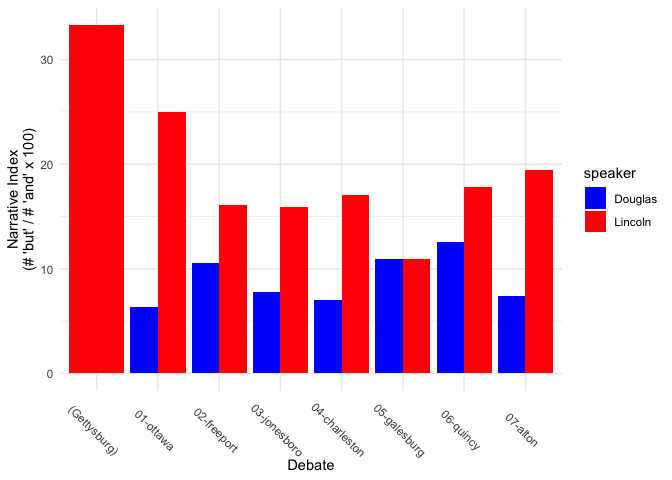

# Data Management and String Handling

*Purpose*: This year’s DataFest dataset includes a lot of string data.
This tutorial is all about working with data, with a particular focus on
string data.

**Important Aside**: I’m going to show you *a lot* of tools. **I am not
expecting you to memorize everything.** You will have access to this
notebook throughout DataFest; if you want to do something like what you
see here, you can just *copy and adapt the code* for your own analysis.

## Optional (But Recommended\!) Readings

If you have time before DataFest, I highly recommend working through the
following reading:

**Working with data** - *Optional Reading*: [Isolating Data with
dplyr](https://rstudio.cloud/learn/primers/2.2) **Note**: In RStudio use
`Ctrl + Click` (Mac `Command + Click`) to follow the link. - *See also*:
[Derive Information with dplyr](https://posit.cloud/learn/primers/2.3)

**Finding patterns in strings** - *Optional Reading*:
[RegexOne](https://regexone.com/) **Note**: In RStudio use `Ctrl +
Click` (Mac `Command + Click`) to follow the link. - *Topics*: All
lessons in the Interactive Tutorial, Additional Practice Problems are
optional. - *Note*: The [stringr
cheatsheet](https://github.com/rstudio/cheatsheets/raw/master/strings.pdf)
is a helpful reference for this exercise\!

# (LIVE DEMO): Analysis of Famous Speeches

In the live demo, I’m going to show you an analysis of famous speeches.
This will illustrate a variety of ways to analyze text data. Before we
can get there, we’ll need to learn some fundamentals of working with
data.

``` r
library(tidyverse)
```

    ## ── Attaching core tidyverse packages ────────────────────────────────────── tidyverse 2.0.0 ──
    ## ✔ dplyr     1.1.1     ✔ readr     2.1.4
    ## ✔ forcats   1.0.0     ✔ stringr   1.5.0
    ## ✔ ggplot2   3.4.1     ✔ tibble    3.2.1
    ## ✔ lubridate 1.9.2     ✔ tidyr     1.3.0
    ## ✔ purrr     1.0.1     
    ## ── Conflicts ──────────────────────────────────────────────────────── tidyverse_conflicts() ──
    ## ✖ dplyr::filter() masks stats::filter()
    ## ✖ dplyr::lag()    masks stats::lag()
    ## ℹ Use the conflicted package (<http://conflicted.r-lib.org/>) to force all conflicts to become errors

## Working with data: Fundamentals

Remember the `mpg` dataset from the previous tutorial?

``` r
mpg
```

    ## # A tibble: 234 × 11
    ##    manufacturer model      displ  year   cyl trans drv     cty   hwy fl    class
    ##    <chr>        <chr>      <dbl> <int> <int> <chr> <chr> <int> <int> <chr> <chr>
    ##  1 audi         a4           1.8  1999     4 auto… f        18    29 p     comp…
    ##  2 audi         a4           1.8  1999     4 manu… f        21    29 p     comp…
    ##  3 audi         a4           2    2008     4 manu… f        20    31 p     comp…
    ##  4 audi         a4           2    2008     4 auto… f        21    30 p     comp…
    ##  5 audi         a4           2.8  1999     6 auto… f        16    26 p     comp…
    ##  6 audi         a4           2.8  1999     6 manu… f        18    26 p     comp…
    ##  7 audi         a4           3.1  2008     6 auto… f        18    27 p     comp…
    ##  8 audi         a4 quattro   1.8  1999     4 manu… 4        18    26 p     comp…
    ##  9 audi         a4 quattro   1.8  1999     4 auto… 4        16    25 p     comp…
    ## 10 audi         a4 quattro   2    2008     4 manu… 4        20    28 p     comp…
    ## # ℹ 224 more rows

We spent a lot of time visualizing this dataset. Visualization is one of
our most useful tools for making sense of data. However, there are some
other really important data management tools we should know how to use.

### Selecting Rows: `filter()`

One of the most useful things we can do is use a `filter` to select
particular rows in a dataset. For instance, we might want to find all of
the cars that have a particular style of transmission:

``` r
filter(mpg, trans == "manual(m6)")
```

    ## # A tibble: 19 × 11
    ##    manufacturer model      displ  year   cyl trans drv     cty   hwy fl    class
    ##    <chr>        <chr>      <dbl> <int> <int> <chr> <chr> <int> <int> <chr> <chr>
    ##  1 audi         a4           2    2008     4 manu… f        20    31 p     comp…
    ##  2 audi         a4 quattro   2    2008     4 manu… 4        20    28 p     comp…
    ##  3 audi         a4 quattro   3.1  2008     6 manu… 4        15    25 p     comp…
    ##  4 chevrolet    corvette     5.7  1999     8 manu… r        16    26 p     2sea…
    ##  5 chevrolet    corvette     6.2  2008     8 manu… r        16    26 p     2sea…
    ##  6 chevrolet    corvette     7    2008     8 manu… r        15    24 p     2sea…
    ##  7 dodge        dakota pi…   3.7  2008     6 manu… 4        15    19 r     pick…
    ##  8 dodge        ram 1500 …   4.7  2008     8 manu… 4        12    16 r     pick…
    ##  9 dodge        ram 1500 …   4.7  2008     8 manu… 4        12    16 r     pick…
    ## 10 dodge        ram 1500 …   4.7  2008     8 manu… 4         9    12 e     pick…
    ## 11 ford         mustang      5.4  2008     8 manu… r        14    20 p     subc…
    ## 12 honda        civic        2    2008     4 manu… f        21    29 p     subc…
    ## 13 hyundai      tiburon      2.7  2008     6 manu… f        16    24 r     subc…
    ## 14 nissan       altima       2.5  2008     4 manu… f        23    32 r     mids…
    ## 15 nissan       altima       3.5  2008     6 manu… f        19    27 p     mids…
    ## 16 toyota       toyota ta…   4    2008     6 manu… 4        15    18 r     pick…
    ## 17 volkswagen   gti          2    2008     4 manu… f        21    29 p     comp…
    ## 18 volkswagen   jetta        2    2008     4 manu… f        21    29 p     comp…
    ## 19 volkswagen   passat       2    2008     4 manu… f        21    29 p     mids…

Using string-detecting patterns, we can make this a bit more general.
The following code finds all the vehicles that have manual transmission
(not just the 6-speed ones):

``` r
filter(mpg, str_detect(trans, "manual"))
```

    ## # A tibble: 77 × 11
    ##    manufacturer model      displ  year   cyl trans drv     cty   hwy fl    class
    ##    <chr>        <chr>      <dbl> <int> <int> <chr> <chr> <int> <int> <chr> <chr>
    ##  1 audi         a4           1.8  1999     4 manu… f        21    29 p     comp…
    ##  2 audi         a4           2    2008     4 manu… f        20    31 p     comp…
    ##  3 audi         a4           2.8  1999     6 manu… f        18    26 p     comp…
    ##  4 audi         a4 quattro   1.8  1999     4 manu… 4        18    26 p     comp…
    ##  5 audi         a4 quattro   2    2008     4 manu… 4        20    28 p     comp…
    ##  6 audi         a4 quattro   2.8  1999     6 manu… 4        17    25 p     comp…
    ##  7 audi         a4 quattro   3.1  2008     6 manu… 4        15    25 p     comp…
    ##  8 chevrolet    corvette     5.7  1999     8 manu… r        16    26 p     2sea…
    ##  9 chevrolet    corvette     6.2  2008     8 manu… r        16    26 p     2sea…
    ## 10 chevrolet    corvette     7    2008     8 manu… r        15    24 p     2sea…
    ## # ℹ 67 more rows

Notice that there are far more vehicles in this dataset. That’s because
there are far more 5-speed vehicles than 6-speed vehicles. We can see
this with a simple `count()`:

``` r
mpg %>% 
  count(trans) %>% 
  arrange(desc(n))
```

    ## # A tibble: 10 × 2
    ##    trans          n
    ##    <chr>      <int>
    ##  1 auto(l4)      83
    ##  2 manual(m5)    58
    ##  3 auto(l5)      39
    ##  4 manual(m6)    19
    ##  5 auto(s6)      16
    ##  6 auto(l6)       6
    ##  7 auto(av)       5
    ##  8 auto(s4)       3
    ##  9 auto(s5)       3
    ## 10 auto(l3)       2

### The Pipe

Above, I used a particular operator called a `pipe`. When using the
Tidyverse, we can use the symbol `%>%` to move data from the output of
one function to the first input of another function. For instance, if we
didn’t use the pipe, we would have to write:

``` r
arrange(count(mpg, trans), desc(n))
```

    ## # A tibble: 10 × 2
    ##    trans          n
    ##    <chr>      <int>
    ##  1 auto(l4)      83
    ##  2 manual(m5)    58
    ##  3 auto(l5)      39
    ##  4 manual(m6)    19
    ##  5 auto(s6)      16
    ##  6 auto(l6)       6
    ##  7 auto(av)       5
    ##  8 auto(s4)       3
    ##  9 auto(s5)       3
    ## 10 auto(l3)       2

This code is completely unreadable. That’s (partly) because the
operations happen “from the inside-out.” Re-writing the code with the
pipe `%>%` makes it much more readable:

``` r
mpg %>% 
  count(trans) %>% 
  arrange(desc(n))
```

    ## # A tibble: 10 × 2
    ##    trans          n
    ##    <chr>      <int>
    ##  1 auto(l4)      83
    ##  2 manual(m5)    58
    ##  3 auto(l5)      39
    ##  4 manual(m6)    19
    ##  5 auto(s6)      16
    ##  6 auto(l6)       6
    ##  7 auto(av)       5
    ##  8 auto(s4)       3
    ##  9 auto(s5)       3
    ## 10 auto(l3)       2

You can think of the pipe `%>%` as the phrase `and then`. With this in
mind, the code above can be read as:

> Start with the dataset `mpg` *and then* count the number of rows
> according to each `trans` *and then* arrange the dataset in descending
> order of `n`

I highly recommend using the pipe operator. You’ll generally have
cleaner, more readable code if you do\!

### Deriving values: `mutate()`

Sometimes we need to edit our data. This is frequently because the data
are not in the right format for analysis. Othertimes, it’s because we
want to derive other useful quantities from the data.

To derive values from a dataset, we can use the `mutate()` function. For
instance, the following code computes the average of the `hwy` and `cty`
fuel economies:

``` r
mpg %>% 
  mutate(avg = (hwy + cty) / 2) %>% 
  # Move the new `avg` column to the front, for visibility
  select(avg, hwy, cty, everything())
```

    ## # A tibble: 234 × 12
    ##      avg   hwy   cty manufacturer model      displ  year   cyl trans drv   fl   
    ##    <dbl> <int> <int> <chr>        <chr>      <dbl> <int> <int> <chr> <chr> <chr>
    ##  1  23.5    29    18 audi         a4           1.8  1999     4 auto… f     p    
    ##  2  25      29    21 audi         a4           1.8  1999     4 manu… f     p    
    ##  3  25.5    31    20 audi         a4           2    2008     4 manu… f     p    
    ##  4  25.5    30    21 audi         a4           2    2008     4 auto… f     p    
    ##  5  21      26    16 audi         a4           2.8  1999     6 auto… f     p    
    ##  6  22      26    18 audi         a4           2.8  1999     6 manu… f     p    
    ##  7  22.5    27    18 audi         a4           3.1  2008     6 auto… f     p    
    ##  8  22      26    18 audi         a4 quattro   1.8  1999     4 manu… 4     p    
    ##  9  20.5    25    16 audi         a4 quattro   1.8  1999     4 auto… 4     p    
    ## 10  24      28    20 audi         a4 quattro   2    2008     4 manu… 4     p    
    ## # ℹ 224 more rows
    ## # ℹ 1 more variable: class <chr>

We can also use a `mutate` to help clean up strings. For instance, we
can remove the number of speeds from `trans` to simplify the column.
Here, I use a regular expression to remove the parentheticals from every
transmission string:

``` r
mpg %>% 
  mutate(trans = str_remove(trans, "\\(.*\\)"))
```

    ## # A tibble: 234 × 11
    ##    manufacturer model      displ  year   cyl trans drv     cty   hwy fl    class
    ##    <chr>        <chr>      <dbl> <int> <int> <chr> <chr> <int> <int> <chr> <chr>
    ##  1 audi         a4           1.8  1999     4 auto  f        18    29 p     comp…
    ##  2 audi         a4           1.8  1999     4 manu… f        21    29 p     comp…
    ##  3 audi         a4           2    2008     4 manu… f        20    31 p     comp…
    ##  4 audi         a4           2    2008     4 auto  f        21    30 p     comp…
    ##  5 audi         a4           2.8  1999     6 auto  f        16    26 p     comp…
    ##  6 audi         a4           2.8  1999     6 manu… f        18    26 p     comp…
    ##  7 audi         a4           3.1  2008     6 auto  f        18    27 p     comp…
    ##  8 audi         a4 quattro   1.8  1999     4 manu… 4        18    26 p     comp…
    ##  9 audi         a4 quattro   1.8  1999     4 auto  4        16    25 p     comp…
    ## 10 audi         a4 quattro   2    2008     4 manu… 4        20    28 p     comp…
    ## # ℹ 224 more rows

This will simplify a call to `count()`:

``` r
mpg %>% 
  mutate(trans = str_remove(trans, "\\(.*\\)")) %>% 
  count(trans)
```

    ## # A tibble: 2 × 2
    ##   trans      n
    ##   <chr>  <int>
    ## 1 auto     157
    ## 2 manual    77

This shows us (clearly) that automatic vehicles are much more common in
this dataset.

## The Gettysburg Address

*Context*: The Gettysburg Address is one of the most famous speeches
ever given. That’s partly because of its historical importance. But it’s
also a *very good speech*. Here’s one opinion on the matter:

> On June 1, 1865, Senator Charles Sumner referred to the most famous
> speech ever given by President Abraham Lincoln. In his eulogy on the
> slain president, he called the Gettysburg Address a “monumental act.”
> He said Lincoln was mistaken that “the world will little note, nor
> long remember what we say here.” Rather, the Bostonian remarked, “The
> world noted at once what he said, and will never cease to remember it.
> The battle itself was less important than the speech.” (Abraham
> Lincoln Online)

Here’s the full text of the Gettysburg Address:

``` r
# The full text of the Gettysburg Address (Bliss' copy)
s_gettysburg <- "Four score and seven years ago our fathers brought forth on this continent, a new nation, conceived in Liberty, and dedicated to the proposition that all men are created equal.

Now we are engaged in a great civil war, testing whether that nation, or any nation so conceived and so dedicated, can long endure. We are met on a great battle-field of that war. We have come to dedicate a portion of that field, as a final resting place for those who here gave their lives that that nation might live. It is altogether fitting and proper that we should do this.

But, in a larger sense, we can not dedicate -- we can not consecrate -- we can not hallow -- this ground. The brave men, living and dead, who struggled here, have consecrated it, far above our poor power to add or detract. The world will little note, nor long remember what we say here, but it can never forget what they did here. It is for us the living, rather, to be dedicated here to the unfinished work which they who fought here have thus far so nobly advanced. It is rather for us to be here dedicated to the great task remaining before us -- that from these honored dead we take increased devotion to that cause for which they gave the last full measure of devotion -- that we here highly resolve that these dead shall not have died in vain -- that this nation, under God, shall have a new birth of freedom -- and that government of the people, by the people, for the people, shall not perish from the earth."
```

I’m going to analyze the text of the Gettysburg Address, in order to
demonstrate some ways to analyze string data.

## Separate into sentences

The `str_split()` function will split a string on a specified character.

``` r
str_split("Statement 1, Statement 2", ",")
```

    ## [[1]]
    ## [1] "Statement 1"  " Statement 2"

This works as expected when “,” is the separating character. If we want
to separate text into sentences, we’ll need to split on periods.
However, we’ll run into a surprise if we try to split on “.”:

``` r
str_split(s_gettysburg, ".") %>% 
  .[[1]] %>% 
  .[1:10]
```

    ##  [1] "" "" "" "" "" "" "" "" "" ""

The “.” character has special meaning for string patterns (regular
expressions); to look for a *literal* period, we have to *escape* it
with `\\`.

``` r
str_split(s_gettysburg, "\\.")
```

    ## [[1]]
    ##  [1] "Four score and seven years ago our fathers brought forth on this continent, a new nation, conceived in Liberty, and dedicated to the proposition that all men are created equal"                                                                                                                                                                                                                                                                                 
    ##  [2] "\n\nNow we are engaged in a great civil war, testing whether that nation, or any nation so conceived and so dedicated, can long endure"                                                                                                                                                                                                                                                                                                                          
    ##  [3] " We are met on a great battle-field of that war"                                                                                                                                                                                                                                                                                                                                                                                                                 
    ##  [4] " We have come to dedicate a portion of that field, as a final resting place for those who here gave their lives that that nation might live"                                                                                                                                                                                                                                                                                                                     
    ##  [5] " It is altogether fitting and proper that we should do this"                                                                                                                                                                                                                                                                                                                                                                                                     
    ##  [6] "\n\nBut, in a larger sense, we can not dedicate -- we can not consecrate -- we can not hallow -- this ground"                                                                                                                                                                                                                                                                                                                                                    
    ##  [7] " The brave men, living and dead, who struggled here, have consecrated it, far above our poor power to add or detract"                                                                                                                                                                                                                                                                                                                                            
    ##  [8] " The world will little note, nor long remember what we say here, but it can never forget what they did here"                                                                                                                                                                                                                                                                                                                                                     
    ##  [9] " It is for us the living, rather, to be dedicated here to the unfinished work which they who fought here have thus far so nobly advanced"                                                                                                                                                                                                                                                                                                                        
    ## [10] " It is rather for us to be here dedicated to the great task remaining before us -- that from these honored dead we take increased devotion to that cause for which they gave the last full measure of devotion -- that we here highly resolve that these dead shall not have died in vain -- that this nation, under God, shall have a new birth of freedom -- and that government of the people, by the people, for the people, shall not perish from the earth"
    ## [11] ""

This has (roughly) split the text into sentences. This is now something
we can fit in a dataset.

``` r
df_gettysburg_raw <- 
  tibble(
    # Note: We have to extract the nested data using brackets [[1]]
    sentence = str_split(s_gettysburg, "\\.")[[1]]
  )

df_gettysburg_raw 
```

    ## # A tibble: 11 × 1
    ##    sentence                                                                     
    ##    <chr>                                                                        
    ##  1 "Four score and seven years ago our fathers brought forth on this continent,…
    ##  2 "\n\nNow we are engaged in a great civil war, testing whether that nation, o…
    ##  3 " We are met on a great battle-field of that war"                            
    ##  4 " We have come to dedicate a portion of that field, as a final resting place…
    ##  5 " It is altogether fitting and proper that we should do this"                
    ##  6 "\n\nBut, in a larger sense, we can not dedicate -- we can not consecrate --…
    ##  7 " The brave men, living and dead, who struggled here, have consecrated it, f…
    ##  8 " The world will little note, nor long remember what we say here, but it can…
    ##  9 " It is for us the living, rather, to be dedicated here to the unfinished wo…
    ## 10 " It is rather for us to be here dedicated to the great task remaining befor…
    ## 11 ""

The address is now organized into sentences, but there’s a bunch of
weird characters. The `\n` characters are *newlines*, a form of
*whitespace*. We can remove all the whitespace using `str_trim()`.

``` r
df_gettysburg <- 
  df_gettysburg_raw %>% 
  mutate(sentence = str_trim(sentence))

df_gettysburg 
```

    ## # A tibble: 11 × 1
    ##    sentence                                                                     
    ##    <chr>                                                                        
    ##  1 "Four score and seven years ago our fathers brought forth on this continent,…
    ##  2 "Now we are engaged in a great civil war, testing whether that nation, or an…
    ##  3 "We are met on a great battle-field of that war"                             
    ##  4 "We have come to dedicate a portion of that field, as a final resting place …
    ##  5 "It is altogether fitting and proper that we should do this"                 
    ##  6 "But, in a larger sense, we can not dedicate -- we can not consecrate -- we …
    ##  7 "The brave men, living and dead, who struggled here, have consecrated it, fa…
    ##  8 "The world will little note, nor long remember what we say here, but it can …
    ##  9 "It is for us the living, rather, to be dedicated here to the unfinished wor…
    ## 10 "It is rather for us to be here dedicated to the great task remaining before…
    ## 11 ""

Now that the Gettysburg Address is in a dataset, we can use a variety of
data management tools\!

## Looking for “but”s

We can search for specific words in a string using `str_detect()`.

``` r
df_gettysburg %>% 
  mutate(
    but = str_detect(sentence, "but"),
    sentence = str_sub(sentence, end = 20) %>% 
      str_c(., "....")
  ) %>% 
  select(but, sentence)
```

    ## # A tibble: 11 × 2
    ##    but   sentence                
    ##    <lgl> <chr>                   
    ##  1 FALSE Four score and seven....
    ##  2 FALSE Now we are engaged i....
    ##  3 FALSE We are met on a grea....
    ##  4 FALSE We have come to dedi....
    ##  5 FALSE It is altogether fit....
    ##  6 FALSE But, in a larger sen....
    ##  7 FALSE The brave men, livin....
    ##  8 TRUE  The world will littl....
    ##  9 FALSE It is for us the liv....
    ## 10 FALSE It is rather for us ....
    ## 11 FALSE ....

This isn’t quite right\! Take a closer look at the line that starts
`But, in a larger sen....`; that detection failed\! We need to catch
both upper and lowercase letters. We can use a regular expression to
search for both lower and upper-case `b`:

``` r
df_gettysburg %>% 
  mutate(
    but = str_detect(sentence, "[Bb]ut"),
    sentence = str_sub(sentence, end = 20) %>% 
      str_c(., "....")
  ) %>% 
  select(but, sentence)
```

    ## # A tibble: 11 × 2
    ##    but   sentence                
    ##    <lgl> <chr>                   
    ##  1 FALSE Four score and seven....
    ##  2 FALSE Now we are engaged i....
    ##  3 FALSE We are met on a grea....
    ##  4 FALSE We have come to dedi....
    ##  5 FALSE It is altogether fit....
    ##  6 TRUE  But, in a larger sen....
    ##  7 FALSE The brave men, livin....
    ##  8 TRUE  The world will littl....
    ##  9 FALSE It is for us the liv....
    ## 10 FALSE It is rather for us ....
    ## 11 FALSE ....

That’s more like it\!

### Lincoln’s Narrative Index

Now for something surprising\! Randy Olson claims that the essence of
effective communication can be understood in terms of storytelling. He
claims that stories can be understood in terms of three fundamental
words: “And”, “But”, and “Therefore”. ABT is a story for another time;
for now, we’ll focus on the *Narrative Index*, a quantitative tool for
assessing how much “story content” there is in a transcript.

*Aside*: For more on the [Narrative
Index](http://www.scienceneedsstory.com/blog/the-narrative-index/),
check out Olson’s website.

The Narrative Index has a very simple definition:

  
  

Olson claims that a higher NI reflects more “narrative content,” and
tends to result in more memorable communication. Let’s test this
assertion\! We can start by computing the NI for the Gettysburg Address.

The following code computes the Narrative Index for the Gettysburg
address. I use the `str_count()` function to count the occurrences in
each sentence, then `summarize()` to sum the counts over every sentence.

``` r
df_ni_gettysburg <- 
  df_gettysburg %>% 
  mutate(
    n_but = str_count(sentence, "[Bb]ut"),
    n_and = str_count(sentence, "[Aa]nd"),
  ) %>% 
  summarize(
    n_but = sum(n_but),
    n_and = sum(n_and),
  ) %>% 
  mutate(ni = n_but / n_and * 100)
df_ni_gettysburg 
```

    ## # A tibble: 1 × 3
    ##   n_but n_and    ni
    ##   <int> <int> <dbl>
    ## 1     2     6  33.3

The NI is \~33 for the Gettysburg Address. But what does that *mean*?
For some context, let’s take a look at the NI for a few other
transcripts.

## The Lincoln-Douglas Debates

I pre-processed all of the text from the Lincoln-Douglas debates. I did
this in a [separate
notebook](https://github.com/zdelrosario/datafest2023-tutorials/blob/main/source/02-data-sm.Rmd);
the code is a bit involved, but you might find some of the steps there
useful for DataFest.

The following code loads the pre-processed Lincoln-Douglas debate
transcripts:

``` r
df_debates <- read_rds("./data/lincoln-douglas-debates.rds")
df_debates
```

    ## # A tibble: 4,097 × 4
    ##    debate    speaker part           sentence                                    
    ##    <chr>     <chr>   <chr>          <chr>                                       
    ##  1 01-ottawa Douglas Opening Speech "200\nMr. Douglas's Opening Speech"         
    ##  2 01-ottawa Douglas Opening Speech "\n\nLADIES AND GENTLEMEN: I appear before …
    ##  3 01-ottawa Douglas Opening Speech " By an arrangement between Mr. Lincoln and…
    ##  4 01-ottawa Douglas Opening Speech "\n\nPrior to 1854 this country was divided…
    ##  5 01-ottawa Douglas Opening Speech " Both were national and patriotic, advocat…
    ##  6 01-ottawa Douglas Opening Speech " An old-line Whig could proclaim his princ…
    ##  7 01-ottawa Douglas Opening Speech " Whig principles had no boundary sectional…
    ##  8 01-ottawa Douglas Opening Speech " So it was, and so it is with the great De…
    ##  9 01-ottawa Douglas Opening Speech " While the Whig and Democratic parties dif…
    ## 10 01-ottawa Douglas Opening Speech " I say that the Whig party and the Democra…
    ## # ℹ 4,087 more rows

Next, I perform the same Narrative Index calculation for each speaker
and debate; this is what calling `group_by()` before a `summarize()`
accomplishes:

``` r
df_ni_debates <- 
  df_debates %>% 
  mutate(
    n_but = str_count(sentence, "[Bb]ut"),
    n_and = str_count(sentence, "[Aa]nd"),
  ) %>% 
  group_by(speaker, debate) %>% 
  summarize(
    n_but = sum(n_but),
    n_and = sum(n_and),
  ) %>% 
  mutate(ni = n_but / n_and * 100)
```

    ## `summarise()` has grouped output by 'speaker'. You can override using the
    ## `.groups` argument.

``` r
df_ni_debates 
```

    ## # A tibble: 14 × 5
    ## # Groups:   speaker [2]
    ##    speaker debate        n_but n_and    ni
    ##    <chr>   <chr>         <int> <int> <dbl>
    ##  1 Douglas 01-ottawa        25   392  6.38
    ##  2 Douglas 02-freeport      35   332 10.5 
    ##  3 Douglas 03-jonesboro     36   460  7.83
    ##  4 Douglas 04-charleston    26   372  6.99
    ##  5 Douglas 05-galesburg     40   365 11.0 
    ##  6 Douglas 06-quincy        37   294 12.6 
    ##  7 Douglas 07-alton         26   353  7.37
    ##  8 Lincoln 01-ottawa        63   252 25   
    ##  9 Lincoln 02-freeport      34   211 16.1 
    ## 10 Lincoln 03-jonesboro     40   251 15.9 
    ## 11 Lincoln 04-charleston    73   428 17.1 
    ## 12 Lincoln 05-galesburg     27   246 11.0 
    ## 13 Lincoln 06-quincy        52   291 17.9 
    ## 14 Lincoln 07-alton         53   272 19.5

Let’s visualize the data:

``` r
df_ni_debates %>% 
  bind_rows(
    df_ni_gettysburg %>% 
      mutate(
        speaker = "Lincoln",
        debate = "(Gettysburg)"
      )
  ) %>% 
  
  ggplot(aes(debate, ni)) +
  geom_col(aes(fill = speaker), position = "dodge") +
  scale_fill_manual(
    values = c("Douglas" = "blue", "Lincoln" = "red")
  ) +
  theme_minimal() +
  theme(axis.text.x = element_text(angle = 315)) +
  labs(
    x = "Debate",
    y = "Narrative Index\n(# 'but' / # 'and' x 100)"
  )
```

<!-- -->

We can make a number of observations:

  - Lincoln generally had a higher Narrative Index than Douglas
      - This suggests that Lincoln was following “storytelling” patterns
        in his debate speeches to a greater degree than Douglas
  - The Gettysburg Address had a *much* higher NI than any of these
    debates
      - This suggests that, even for a “storytelling-heavy” speaker like
        Lincoln, the Gettysburg Address was a particularly
        narrative-heavy speech.
      - Given how memorable this speech is, the results seem to agree
        with Olson’s assertion that a high NI corresponds with a more
        memorable communication.

## Relative frequencies

One last analysis; we can look for interesting trends by comparing the
frequency of words in our dataset against the frequency of words as they
tend to occur in other sources.

The following downloads a word frequency dataset from [Peter Norvig’s
website](http://norvig.com/ngrams/). This is from the *Google Web
Trillion Word Corpus*, which will reflect more modern speech, rather
than the contemporary speech patterns at the time of the Gettysburg
Address.

``` r
url_count1w <- "http://norvig.com/ngrams/count_1w.txt"
filename_count1w <- "./data/count_1w.txt"

## Download the data locally
curl::curl_download(
  url_count1w,
  destfile = filename_count1w
)

## Loads the downloaded file
df_words_web <- read_delim(
  filename_count1w,
  col_names = c("word", "n")
) %>% 
  mutate(f = n / sum(n))
```

    ## Rows: 333333 Columns: 2
    ## ── Column specification ──────────────────────────────────────────────────────────────────────
    ## Delimiter: "\t"
    ## chr (1): word
    ## dbl (1): n
    ## 
    ## ℹ Use `spec()` to retrieve the full column specification for this data.
    ## ℹ Specify the column types or set `show_col_types = FALSE` to quiet this message.

``` r
df_words_web
```

    ## # A tibble: 333,333 × 3
    ##    word            n       f
    ##    <chr>       <dbl>   <dbl>
    ##  1 the   23135851162 0.0393 
    ##  2 of    13151942776 0.0224 
    ##  3 and   12997637966 0.0221 
    ##  4 to    12136980858 0.0206 
    ##  5 a      9081174698 0.0154 
    ##  6 in     8469404971 0.0144 
    ##  7 for    5933321709 0.0101 
    ##  8 is     4705743816 0.00800
    ##  9 on     3750423199 0.00638
    ## 10 that   3400031103 0.00578
    ## # ℹ 333,323 more rows

We can produce a similar frequency dataset for the Gettysburg Address:

``` r
df_words_gettysburg <- 
  df_gettysburg %>% 
  mutate(word = str_split(sentence, "\\s+|[[:punct:]]")) %>% 
  select(word) %>% 
  unnest_longer(word) %>% 
  mutate(word = str_to_lower(word)) %>% 
  filter(str_detect(word, "\\w+")) %>% 
  count(word) %>% 
  mutate(f = n / sum(n)) %>% 
  arrange(desc(n))

df_words_gettysburg
```

    ## # A tibble: 138 × 3
    ##    word      n      f
    ##    <chr> <int>  <dbl>
    ##  1 that     13 0.0478
    ##  2 the      11 0.0404
    ##  3 we       10 0.0368
    ##  4 here      8 0.0294
    ##  5 to        8 0.0294
    ##  6 a         7 0.0257
    ##  7 and       6 0.0221
    ##  8 can       5 0.0184
    ##  9 for       5 0.0184
    ## 10 have      5 0.0184
    ## # ℹ 128 more rows

By merging the two datasets on the `word` column, we can compare the
frequency from the Gettysburg Address against the modern frequency
database.

``` r
df_compare_words <- 
  df_words_gettysburg %>% 
  select(word, n, f) %>% 
  left_join(
    df_words_web %>% select(word, f),
    by = "word",
    suffix = c("_gettysburg", "_web")
  ) %>% 
  mutate(r = f_gettysburg / f_web)

df_compare_words %>% 
  arrange(desc(r))
```

    ## # A tibble: 138 × 5
    ##    word            n f_gettysburg       f_web      r
    ##    <chr>       <int>        <dbl>       <dbl>  <dbl>
    ##  1 consecrate      1      0.00368 0.000000193 19060.
    ##  2 nobly           1      0.00368 0.000000202 18206.
    ##  3 hallow          1      0.00368 0.000000238 15417.
    ##  4 consecrated     1      0.00368 0.000000850  4323.
    ##  5 dedicate        2      0.00735 0.00000171   4306.
    ##  6 detract         1      0.00368 0.000000896  4104.
    ##  7 perish          1      0.00368 0.00000154   2388.
    ##  8 devotion        2      0.00735 0.00000394   1865.
    ##  9 conceived       2      0.00735 0.00000479   1535.
    ## 10 endure          1      0.00368 0.00000328   1119.
    ## # ℹ 128 more rows

This gives a sense for which words Lincoln used that are not so common
(compared to modern speech). This isn’t a great estimate for Lincoln’s
*general* speech patterns (it’s a short speech, and many of these
uncommon words are used just once), but it does pick out some “curious”
words.

# (EXERCISES)
